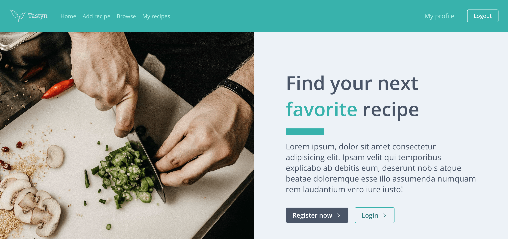
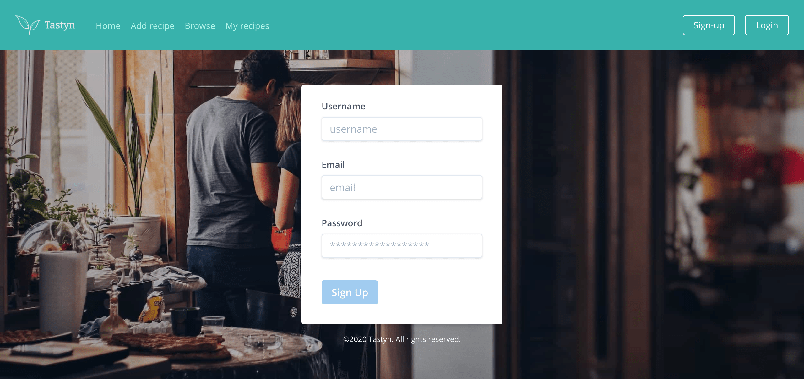
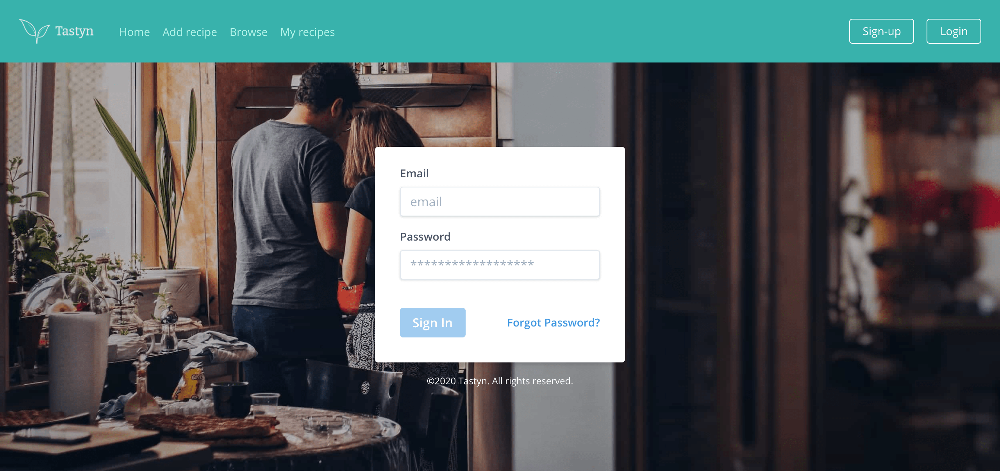
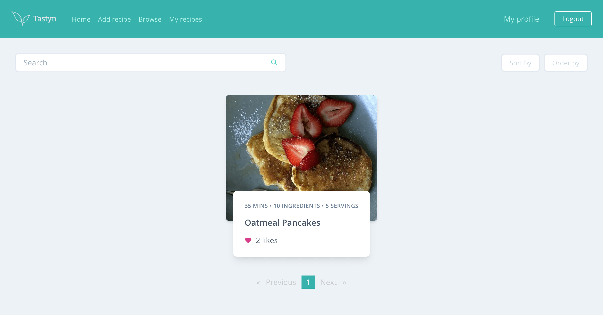
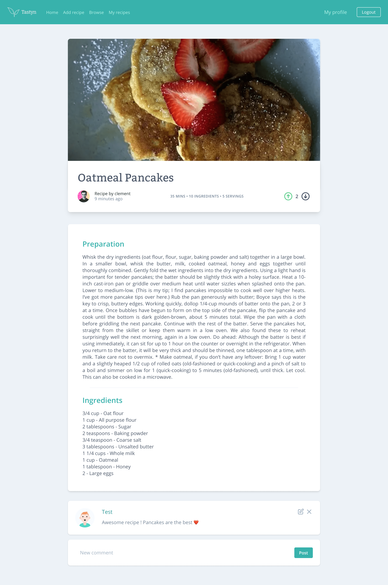
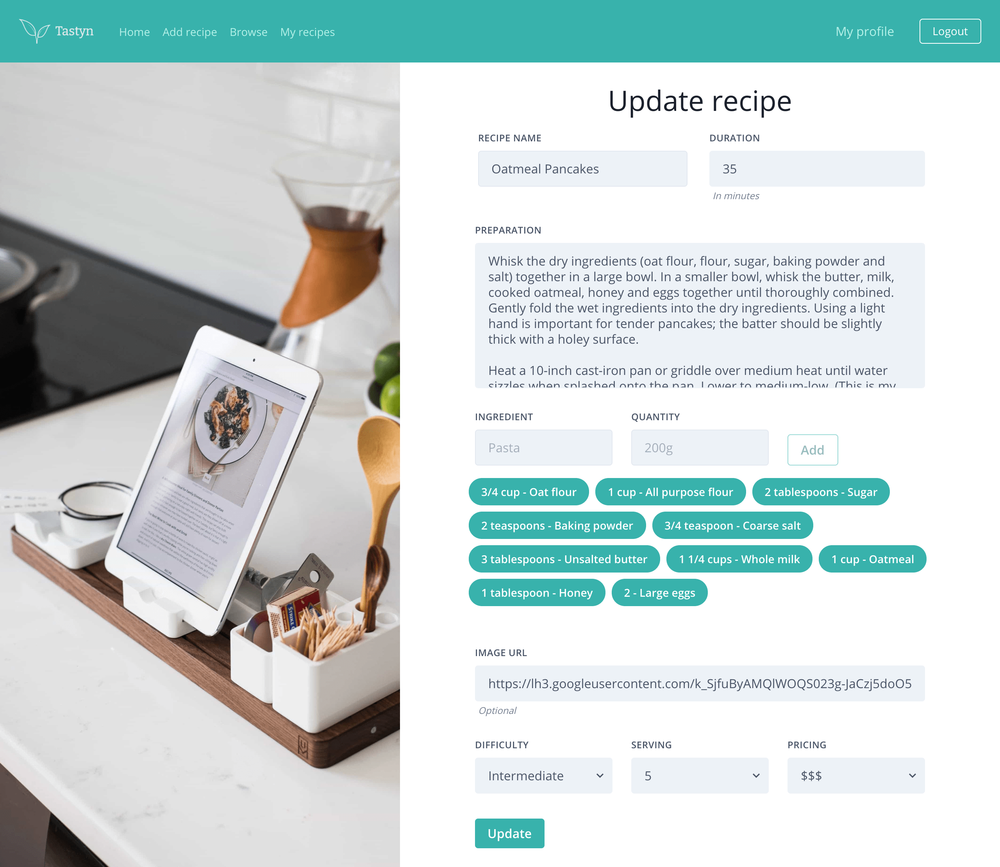
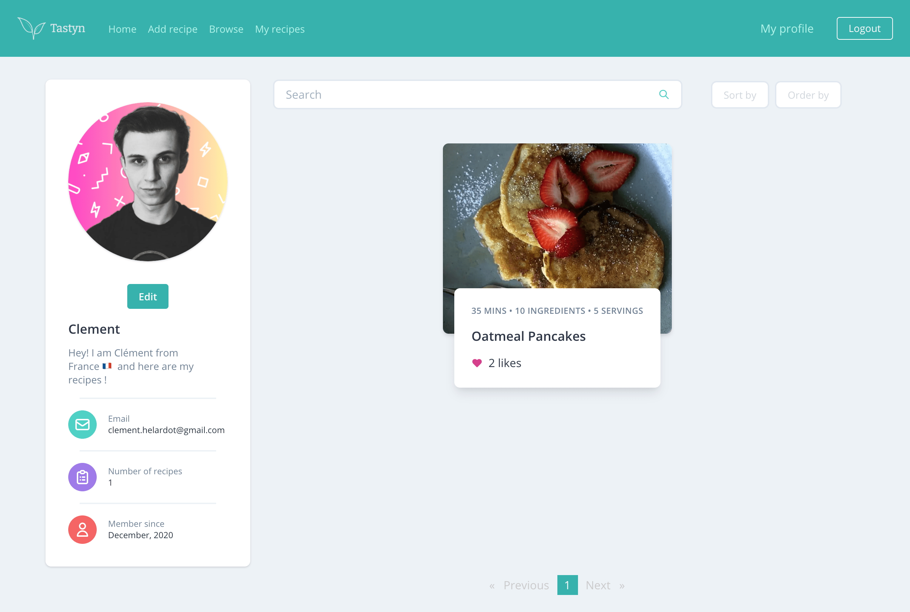

# Tastyn

Tastyn is an app to create, browse and share recipes with other users.

Built with:

- Angular
- Spring Boot
- PostgreSQL
- JWT authentication
- TailwindCSS

## Features

- You can register / sign up as a user to browse recipes
- Fill up your profile
- View somebodies profile
- Add a recipe
- Upvote / downvote a recipe
- Leave a comment under a recipe

## Screenshots

Home


Signup


Login


Browse through recipes


Recipe details


Update a recipe


User profile


## Installation

The application is composed of a Frontend app (Angular) & a backend app (Spring Boot) with a PostgreSQL database.

### Database

Start Postgresql database with default port 5432 & create a database called "**tastyn**.

### Backend

```bash
cd backend
./mvnw spring-boot:run
```

### Frontend

```bash
cd frontend
npm install
ng serve
```

In your browser open **localhost:4200**.

## Deployment

It is possible to deploy this app using docker. To do so, download the source code and do the following:

```bash
cd backend
./mwnw clean package

cd frontend
npm run build:prod

cd ..
docker-compose up

## OR

docker-compose up -d # to run in detached mode
```

This will create 3 containers:

- 1 for the PostgreSQL database.
- 1 for the Spring Boot backend.
- 1 for the Angular frontend.

You can then open your browser at **localhost**.

## Contributing

Pull requests are welcome. For major changes, please open an issue first to discuss what you would like to change.

## License

[MIT](https://choosealicense.com/licenses/mit/)
